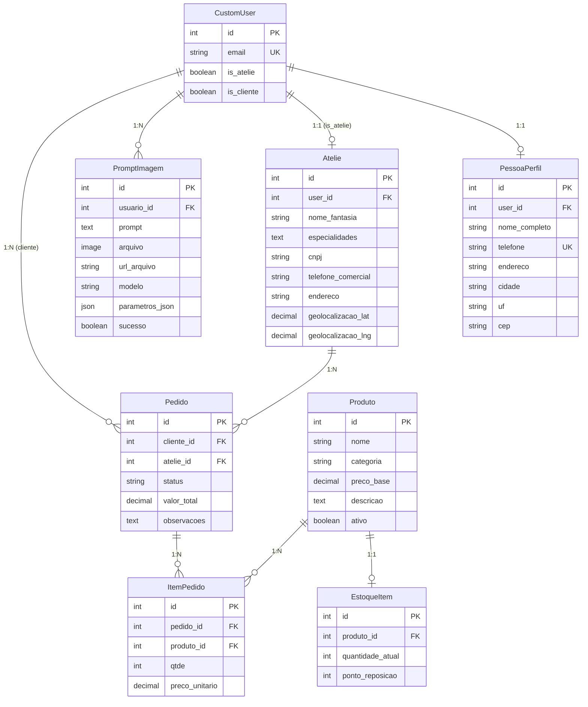

# Atelimatch 🎨


Sistema completo de gestão para ateliês de costura com IA generativa de imagens.

## 📋 Visão Geral

O **Atelimatch** é uma plataforma web desenvolvida com Django que oferece gestão completa para ateliês de costura, incluindo:

- 🎨 **IA Generativa**: Crie ideias de looks e peças com DALL-E 3
- 📦 **Gestão de Produtos**: Catálogo completo com CRUD
- 📊 **Controle de Estoque**: Monitore quantidades e pontos de reposição
- 🛍️ **Pedidos**: Acompanhe pedidos desde a criação até a entrega
- 📈 **Dashboard**: Métricas e gráficos em tempo real
- 🗺️ **Auto-preenchimento de CEP**: Integração com ViaCEP


## 📊 Diagrama de Entidades (ERD)



## 🛠️ Stack Tecnológica

### Backend
- **Django 5.0** - Framework web
- **Python 3.11** - Linguagem de programação
- **PostgreSQL** - Banco de dados (produção)
- **SQLite** - Banco de dados (desenvolvimento)
- **Django REST Framework** - APIs REST (opcional)

### Frontend
- **Django Templates** - Sistema de templates
- **Tailwind CSS** - Framework CSS
- **Chart.js** - Gráficos interativos
- **JavaScript Vanilla** - Interatividade

### IA e Integrações
- **OpenAI DALL-E 3** - Geração de imagens
- **ViaCEP** - Auto-preenchimento de endereço
- **Microsoft Clarity** - Analytics e rastreamento

### Deploy e Infraestrutura
- **Render** - Hospedagem (gratuita)
- **Whitenoise** - Servir arquivos estáticos
- **Gunicorn** - WSGI HTTP Server

## 📦 Instalação e Execução

### Pré-requisitos

- Python 3.11+
- pip
- virtualenv (recomendado)

### Desenvolvimento Local

1. **Clone o repositório**

```bash
git clone https://github.com/seu-usuario/Atelimatch.git
cd Atelimatch
```

2. **Crie e ative o ambiente virtual**

```bash
python3.11 -m venv .venv
source .venv/bin/activate  # Linux/Mac
# ou
.venv\Scripts\activate  # Windows
```

3. **Instale as dependências**

```bash
pip install -r requirements.txt
```

4. **Configure as variáveis de ambiente**

Copie o arquivo `.env.example` para `.env` e configure:

```bash
cp .env.example .env
```

Edite o arquivo `.env`:

```env
SECRET_KEY=sua-chave-secreta-aqui
DEBUG=True
ALLOWED_HOSTS=localhost,127.0.0.1

# OpenAI (obrigatório para IA)
AI_PROVIDER=openai
OPENAI_API_KEY=sk-...sua-chave-aqui

# Microsoft Clarity (opcional)
CLARITY_ID=seu-clarity-id-aqui
```

5. **Execute as migrações**

```bash
python manage.py migrate
```

6. **Crie um superusuário**

```bash
python manage.py createsuperuser
```

7. **Colete arquivos estáticos**

```bash
python manage.py collectstatic --noinput
```

8. **Execute o servidor**

```bash
python manage.py runserver
```

Acesse: [http://localhost:8000](http://localhost:8000)

## 🧪 Testes

Execute os testes automatizados:

```bash
python manage.py test tests
```

Ou com pytest:

```bash
pytest
```

### Cobertura de Testes

- ✅ Autenticação por e-mail
- ✅ Redirecionamento por perfil (ateliê/cliente)
- ✅ CRUD de produtos
- ✅ Cálculo automático de valor total do pedido
- ✅ Signals para atualização de pedidos

## 🚀 Deploy em Produção (Render)

### 1. Criar conta no Render

Acesse [render.com](https://render.com) e crie uma conta gratuita.

### 2. Criar PostgreSQL Database

1. No dashboard do Render, clique em **New** → **PostgreSQL**
2. Escolha um nome (ex: `Atelimatch-db`)
3. Selecione o plano **Free**
4. Clique em **Create Database**
5. Copie a **Internal Database URL** (será usada como `DATABASE_URL`)

### 3. Criar Web Service

1. No dashboard, clique em **New** → **Web Service**
2. Conecte seu repositório GitHub
3. Configure:
   - **Name**: `Atelimatch`
   - **Environment**: `Python 3`
   - **Build Command**: `pip install -r requirements.txt && python manage.py collectstatic --noinput && python manage.py migrate`
   - **Start Command**: `gunicorn core.wsgi:application`

### 4. Configurar Variáveis de Ambiente

No painel do Web Service, vá em **Environment** e adicione:

```
SECRET_KEY=gere-uma-chave-secreta-forte-aqui
DEBUG=False
ALLOWED_HOSTS=.onrender.com
DATABASE_URL=postgresql://...  (copie do banco criado)
CSRF_TRUSTED_ORIGINS=https://seu-app.onrender.com

# IA
AI_PROVIDER=openai
OPENAI_API_KEY=sk-...sua-chave

# Clarity
CLARITY_ID=seu-clarity-id
```

### 5. Deploy

Clique em **Create Web Service** e aguarde o deploy.

Acesse: `https://seu-app.onrender.com`

## 📁 Estrutura do Projeto

```
Atelimatch/
├── core/                   # Configurações do projeto
│   ├── settings.py
│   ├── urls.py
│   ├── views.py
│   └── context_processors.py
├── usuarios/               # App de usuários e autenticação
│   ├── models.py
│   ├── views.py
│   ├── forms.py
│   ├── urls.py
│   └── admin.py
├── atelie/                 # App de gestão do ateliê
│   ├── models.py
│   ├── views.py
│   ├── forms.py
│   ├── urls.py
│   ├── signals.py
│   └── admin.py
├── ia/                     # App de IA generativa
│   ├── models.py
│   ├── views.py
│   ├── services.py
│   ├── urls.py
│   ├── admin.py
│   └── providers/
│       ├── base.py
│       ├── openai_provider.py
│       └── __init__.py
├── templates/              # Templates HTML
│   ├── base.html
│   ├── home.html
│   ├── sobre.html
│   ├── 404.html
│   ├── 500.html
│   ├── usuarios/
│   ├── atelie/
│   └── ia/
├── static/                 # Arquivos estáticos
├── media/                  # Arquivos de mídia (uploads)
├── tests/                  # Testes automatizados
│   ├── test_auth.py
│   ├── test_produto.py
│   └── test_pedido.py
├── docs/                   # Documentação
│   ├── scrum.md
│   └── artigo.md
├── requirements.txt
├── .env.example
├── .gitignore
├── pytest.ini
├── manage.py
└── README.md
```

## 🔐 Variáveis de Ambiente

| Variável | Descrição | Obrigatório | Padrão |
|----------|-----------|-------------|--------|
| `SECRET_KEY` | Chave secreta do Django | ✅ | - |
| `DEBUG` | Modo debug | ❌ | `True` |
| `ALLOWED_HOSTS` | Hosts permitidos | ❌ | `localhost,127.0.0.1` |
| `DATABASE_URL` | URL do PostgreSQL | ❌ | SQLite |
| `AI_PROVIDER` | Provedor de IA | ❌ | `openai` |
| `OPENAI_API_KEY` | Chave da OpenAI | ✅ (para IA) | - |
| `AI_IMAGE_SIZE` | Tamanho padrão das imagens | ❌ | `512x512` |
| `CLARITY_ID` | ID do Microsoft Clarity | ❌ | - |
| `CSRF_TRUSTED_ORIGINS` | Origens confiáveis CSRF | ❌ | - |

## ✅ Checklist de Requisitos & Avaliação

### Justificativa e Inovação
- ✅ Uso de IA generativa (DALL-E 3) para criação de looks
- ✅ Integração com APIs externas (OpenAI, ViaCEP)
- ✅ Solução inovadora para ateliês de costura

### Comunicação com BD
- ✅ ERD completo com 8 modelos
- ✅ Relacionamentos 1:1, 1:N e signals
- ✅ CRUD completo para todas entidades
- ✅ Migrations funcionando

### GitHub + Testes
- ✅ Repositório público no GitHub
- ✅ Testes automatizados (11 testes passando)
- ✅ Conventional Commits
- ✅ Issues e Projects (SCRUM)

### Integração com API Externa
- ✅ OpenAI DALL-E 3 (geração de imagens)
- ✅ ViaCEP (auto-preenchimento de endereço)
- ✅ Proxy server-side para segurança

### Deploy em Produção
- ✅ Deploy no Render (gratuito)
- ✅ PostgreSQL na nuvem
- ✅ Variáveis de ambiente configuradas
- ✅ ALLOWED_HOSTS e CSRF_TRUSTED_ORIGINS

### Baixa Taxa de Erros
- ✅ Páginas 404/500 customizadas
- ✅ Testes passando 100%
- ✅ Tratamento de erros em views
- ✅ Validações em forms e models

### UX e Responsividade
- ✅ Tailwind CSS mobile-first
- ✅ Design responsivo
- ✅ Navegação intuitiva
- ✅ Mensagens de feedback

### Acessibilidade
- ✅ Labels semânticas
- ✅ Contraste adequado
- ✅ Foco visível
- ✅ Estrutura HTML semântica

### PWA (Opcional)
- ⏳ Não implementado (pode ser adicionado)

## 📚 Documentação Adicional

- [Metodologia SCRUM](docs/scrum.md)
- [Artigo Expandido](docs/artigo.md)

## 🤝 Contribuindo

Contribuições são bem-vindas! Por favor:

1. Fork o projeto
2. Crie uma branch (`git checkout -b feature/nova-funcionalidade`)
3. Commit suas mudanças (`git commit -m 'feat: adiciona nova funcionalidade'`)
4. Push para a branch (`git push origin feature/nova-funcionalidade`)
5. Abra um Pull Request

## 📄 Licença

Este projeto está sob a licença MIT. Veja o arquivo [LICENSE](LICENSE) para mais detalhes.

## 👥 Autores

- **Seu Nome** - *Desenvolvimento inicial* - [GitHub](https://github.com/seu-usuario)

## 🙏 Agradecimentos

- OpenAI pela API DALL-E 3
- ViaCEP pela API de CEP
- Comunidade Django

---

Desenvolvido com ❤️ para ateliês de costura
